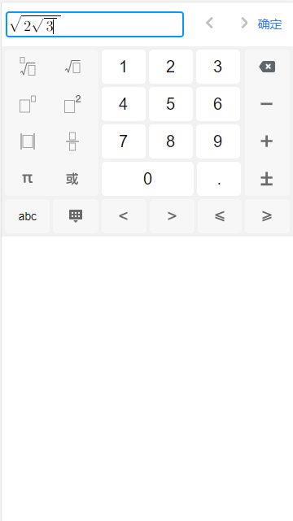

# math-keyboard

> 基于vue项目的移动端latex数学公式键盘(仿洋葱学院)
>
> fork from: https://github.com/MilkyMoon/math-keyboard
>做了一些修改，去掉了手写功能，注释了一些不常用的符号。

[原项目演示地址](http://www.codwiki.cn/laboratory/keyboard)




### 插件的安装

#### NPM

```
npm i math-keyboard
```

#### 插件依赖

```html
由于本插件公式渲染使用了mathquill.js,该插件依赖于JQuery，所以需要正确应用JQuery

<script src="https://apps.bdimg.com/libs/jquery/2.1.4/jquery.min.js"></script>
```

#### 引入插件

```
import Vue from 'vue';
import MathKeyboard from 'math-keyboard';

Vue.use(MathKeyboard);
```

## Build Setup

```bash
# install dependencies
npm install

# serve with hot reload at localhost:8080
npm run dev

# build for production with minification
npm run build
```

### 
